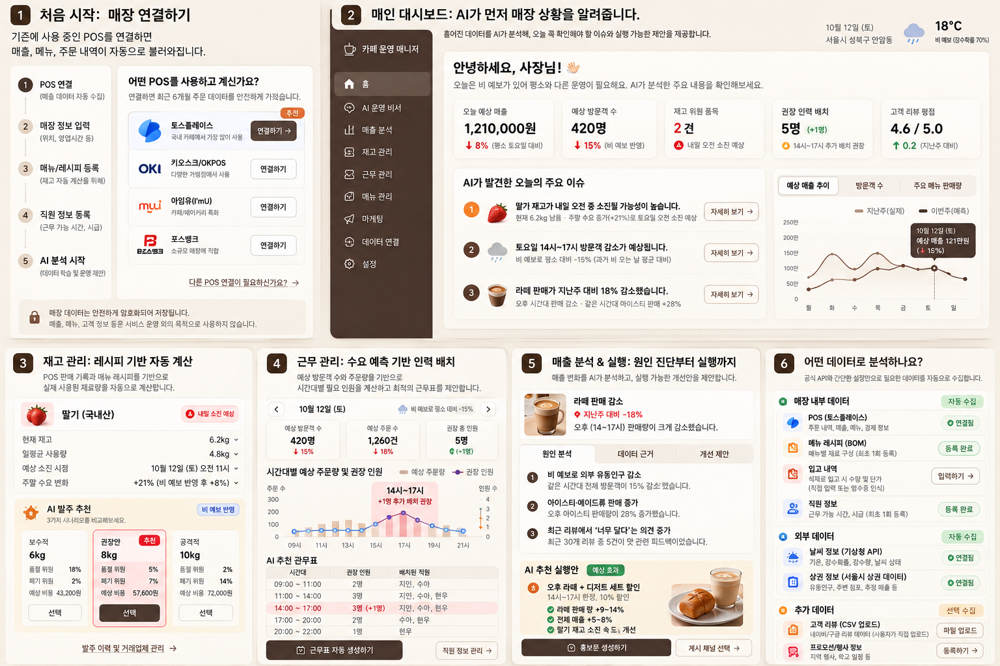
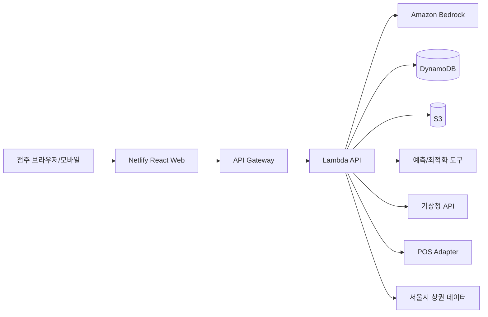

# AI CafeOps PRD

> **프로젝트 가칭:** AI CafeOps / 카페 운영 매니저  
> **한 줄 정의:** POS·재고·날씨·상권 데이터를 연결해, 카페 점주에게 **오늘 무엇을 발주하고, 몇 명을 배치하고, 어떤 대응을 해야 하는지 먼저 제안하는 AI 매장 운영 에이전트**  
> **대회:** AI Innovators Challenge  
> **배포 목표:** GitHub 공개 저장소 + Netlify 웹 배포  
> **클라이언트:** PC / 모바일 반응형 웹  
> **문서 버전:** v1.0 / 2026-09-29

---

## 0. Executive Summary

카페에는 이미 POS를 통해 주문·매출 데이터가 축적되고, 날씨·상권 데이터도 외부에서 확보할 수 있다. 그러나 매일 반복되는 **수요 예측 → 재고·발주 → 인력 배치 → 프로모션** 의사결정을 연결해서 수행하는 일은 여전히 점주의 경험과 감에 크게 의존한다.

AI CafeOps는 기존 POS나 ERP를 대체하지 않는다. **기록 시스템 위에 올라가는 의사결정 계층(decision layer)** 이다. POS·날씨·매장 운영 데이터를 읽고, AI 운영 에이전트가 문제를 먼저 감지한 뒤 수요 예측·수리 최적화 도구를 호출해 여러 운영 대안을 계산한다. 비용이나 직원 근무에 영향을 주는 행동은 점주의 승인을 거친다.

핵심 차별점은 세 가지다.

1. **대시보드가 아니라 선제형 에이전트**: 점주가 숫자를 찾아보는 대신 AI가 먼저 이상징후와 기회를 발견한다.
2. **연결형 운영 의사결정**: 날씨 변화 하나가 수요·재고·인력·프로모션에 미치는 영향을 연쇄적으로 재계산한다.
3. **추천이 아니라 선택 가능한 대안**: 보수적·권장·공격적 발주안처럼 비용, 품절 위험, 폐기 위험의 trade-off를 비교해 보여준다.

MVP는 **카페·베이커리**를 타깃으로 하며, 핵심 기능은 `① 수요 예측 ② 재고/발주 추천 ③ 인력 배치 추천`이다. 리뷰 분석·홍보문 생성은 부가기능으로 구현한다.

---

# 1. 개발 목적과 문제 정의

## 1.1 왜 카페인가

### 시장 측면
- 국세청 사업자 통계를 인용한 2025년 보도에 따르면 2025년 1분기 국내 커피음료점은 **95,337개**로 전년 동기보다 743개 줄어, 2018년 통계 집계 이후 처음 감소했다.
- 2026년 공정거래위원회 제출 자료를 인용한 보도에 따르면, 가맹점 수 기준 상위 10개 커피 프랜차이즈의 점포는 **2021년 11,109개 → 2024년 15,692개(+41.3%)**로 증가했다.

즉 카페는 **점포 수와 경쟁 강도가 매우 높은 동시에, 개별 점포의 생존과 운영 효율이 중요해진 업종**이다.

### 운영 측면
카페는 AI 기반 운영 최적화가 특히 잘 맞는다.

- SKU와 메뉴가 비교적 표준화되어 있다.
- 우유·과일·베이커리 등 유통기한이 있는 재료가 많아 폐기/품절 비용이 동시에 존재한다.
- 주문 데이터가 POS에 시간 단위로 축적된다.
- 수요가 요일·시간대·날씨에 민감하다.
- 피크타임 인력 부족과 비피크 인력 과잉을 동시에 관리해야 한다.
- 동일 프랜차이즈라도 상권·날씨·고객구성에 따라 점포별 최적 운영이 달라진다.

### 제품 관점의 핵심 가설
> **본사는 운영 표준을 만든다. AI CafeOps는 그 표준 안에서 ‘오늘 이 매장은 어떻게 운영해야 하는가’를 계산한다.**

따라서 초기 타깃은 **1~3개 매장을 운영하는 프랜차이즈/개인 카페 점주**다. 대형 본사의 자체 데이터 조직보다 도입 장벽은 낮고, 단일 영세 매장보다 데이터 축적과 지불 의사가 존재할 가능성이 높은 세그먼트다.

---

## 1.2 현재 사용자 문제

점주에게 데이터가 없는 것이 아니다. 문제는 **연결된 결정을 내리는 데 시간과 전문성이 필요하다는 것**이다.

예시:

- POS: “토요일 오후 아이스라떼 83잔 판매”
- 날씨 앱: “토요일 강수확률 70%”
- 재고 장부: “우유 14L 남음”
- 근무표: “14~17시 2명 배치”

현재 점주는 이 네 정보를 직접 결합해 다음을 결정해야 한다.

1. 토요일 실제 수요가 어느 정도인가?
2. 우유를 몇 L 추가 발주해야 하는가?
3. 14~17시에 직원이 한 명 더 필요한가?
4. 수요 감소가 예상되면 어떤 메뉴 프로모션을 할 것인가?

AI CafeOps의 역할은 **데이터 열람을 자동화하는 것이 아니라, 이 연결된 의사결정 자체를 지원하는 것**이다.

---

# 2. 서비스 포지셔닝과 차별화

## 2.1 포지셔닝

### 나쁜 정의
> AI로 카페 매출과 재고를 관리하는 서비스

### 권장 정의
> **매장에 변화가 생겼을 때 그 변화가 수요·재고·인력에 미치는 영향을 계산하고, 실행 가능한 운영안을 먼저 제시하는 AI 카페 운영 에이전트**

### 핵심 메시지
> **기록에서 결정으로.**  
> POS에 쌓이는 데이터를, 내일의 운영안으로 바꾼다.

---

## 2.2 기존 도구 대비 차별점

| 구분 | 일반 POS | 기존 분석 대시보드 | AI CafeOps |
|---|---|---|---|
| 주문·매출 기록 | O | O | O(연동) |
| 지표 조회 | O | O | O |
| 수요 예측 | 제한적 | 일부 | O |
| 재고 추천 | 제한적 | 일부 | O |
| 인력 배치 | X/별도 | 일부 | O |
| 자연어 요청 | X | 제한적 | O |
| AI가 먼저 이슈 감지 | X | 제한적 | **핵심** |
| 한 변수 변화의 연쇄 재계산 | X | 제한적 | **핵심** |
| 대안별 비용/위험 비교 | X | 제한적 | **핵심** |
| 사용자 우선순위 자연어 변경 | X | X/제한적 | **핵심** |
| 고위험 행동 승인 후 실행 | X | 일부 | **핵심** |

> 기능 하나하나의 세계 최초를 주장하지 않는다. 차별점은 **여러 운영 기능을 한 개의 사건에서 연쇄적으로 계산하는 의사결정 흐름**에 있다.

---

# 3. 목표 / 비목표

## 3.1 MVP 목표

1. 카페 POS 형태의 주문 이력을 받아 **일·시간대·메뉴 단위 수요를 예측**한다.
2. 레시피(BOM)와 현재 재고를 결합해 **발주 필요량과 품절/폐기 위험**을 계산한다.
3. 예상 주문량과 직원 가능시간을 결합해 **권장 인력 및 근무표**를 생성한다.
4. AI 운영 에이전트가 데이터를 해석하고 필요한 분석 도구를 **Tool Calling**으로 호출한다.
5. 중요한 추천마다 **근거 데이터와 대안 시나리오**를 보여준다.
6. 발주·근무표 변경과 같이 비용/사람에 영향을 주는 행동은 **사장님 승인 기반 실행(Human-in-the-loop)** 으로 제한한다.
7. PC와 모바일에서 동일한 기능을 제공하는 **반응형 웹앱**을 구현한다.
8. GitHub에 재현 가능한 코드를 올리고 Netlify에 프런트엔드를 배포한다.

## 3.2 MVP 비목표

- 실제 금융 결제/발주 거래 체결
- 급여 정산 및 노무법 준수 판정
- 회계/세무 자동화
- 전 프랜차이즈 본사 ERP 대체
- 네이버/카카오 리뷰 무단 크롤링
- 모든 POS 사업자 연동
- 완전 자율 실행(autonomous purchasing)

---

# 4. 주요 사용자와 JTBD

## Persona A — 1개 매장 점주
- 매일 매장에 상주
- POS는 사용하지만 Excel 분석은 거의 하지 않음
- 재고는 경험적으로 발주
- 근무표는 카톡/메모로 조정

**JTBD**
> “아침에 앱을 열었을 때, 오늘 반드시 신경 써야 할 것과 가장 합리적인 대응안을 1분 안에 알고 싶다.”

## Persona B — 2~3개 매장 운영 점주
- 매장별 현장 상황을 직접 보기 어려움
- 점장 보고에 의존
- 매장별 성과 차이의 원인 파악이 어려움

**JTBD**
> “각 매장을 일일이 들여다보지 않고도, 문제가 있는 매장과 이유를 먼저 알고 싶다.”

## Persona C — 점장
- 발주 및 근무 운영 실무 담당
- 점주 승인이 필요한 변경이 존재

**JTBD**
> “근거 있는 운영안을 빠르게 만들고 점주에게 승인 요청하고 싶다.”

---

# 5. 핵심 유저 플로우

## 5.1 온보딩 — 데이터가 들어오는 창구를 먼저 설득한다

### Step 1. 계정/매장 생성
- 이메일 로그인
- 매장명, 주소, 영업시간
- 개인카페 / 프랜차이즈 선택

### Step 2. POS 연결
우선 지원:
1. **토스플레이스 Open API 연결**
2. CSV 업로드 fallback
3. 데모 모드(샘플 데이터)

화면 문구:
> “POS를 연결하면 주문·결제·상품 정보를 자동으로 불러옵니다. 원본 POS를 변경하지 않으며, 분석에 필요한 데이터만 읽습니다.”

### Step 3. 메뉴·레시피(BOM) 등록
- 메뉴별 판매가격
- 원재료와 1잔당 사용량
- 원재료 단가 / 최소 발주단위 / 유통기한(선택)
- 프랜차이즈 표준 레시피 CSV 가져오기 지원

### Step 4. 현재 재고/입고 정보
- 최초 현재고 입력
- 이후 입고 시 간단 등록
- 향후 거래명세서 사진 OCR 확장

### Step 5. 직원 등록
- 이름/별칭
- 시급
- 근무 가능요일/시간
- 주 최대 근무시간

### Step 6. 외부 데이터 자동 연결
- 매장 주소 → 기상청 예보 위치 매핑
- 서울 매장 → 서울시 상권 데이터 매핑

### Step 7. 분석 시작
- 최소 2주 이상 주문 데이터면 실데이터 기반 예측
- 데이터 부족 시 업종/요일 baseline + 불확실성 표시

**완료 상태**
> “매장 연결 완료. 내일부터 AI가 매장 운영 이슈를 먼저 알려드립니다.”

---

## 5.2 Daily Brief — 앱을 열면 ‘숫자’보다 ‘해야 할 일’을 먼저 본다

### 홈 화면
상단 KPI:
- 오늘 예상 매출
- 예상 방문/주문 수
- 재고 위험 품목 수
- 인력 부족 시간대

### AI가 발견한 오늘의 주요 이슈
예:
1. “딸기 재고가 내일 오전 중 소진될 가능성이 높습니다.”
2. “토요일 14~17시 예상 주문이 평소보다 24% 높습니다.”
3. “금요일 오후 카페라떼 판매가 전주보다 18% 낮습니다.”

각 카드는:
- 영향도
- 근거 1~2개
- `자세히 보기`

---

## 5.3 이슈 상세 → 시나리오 비교 → 승인

예: `딸기 품절 위험` 클릭

### 근거
- 현재 재고 6.2kg
- 최근 7일 평균 사용량 4.8kg/일
- 주말 예상 수요 +21%
- 예상 소진 토요일 오전 11시

### 발주 시나리오
| 시나리오 | 추가 발주 | 품절 위험 | 폐기 위험 | 예상 비용 |
|---|---:|---:|---:|---:|
| 보수적 | 6kg | 18% | 3% | 43,200원 |
| **권장** | **8kg** | **5%** | **7%** | **57,600원** |
| 공격적 | 10kg | 2% | 14% | 72,000원 |

사용자가 질문:
> “주말 비 예보도 반영됐어?”

에이전트:
1. Weather Tool 호출
2. 수요예측 재실행
3. 재고 최적화 재실행
4. 새 결과와 변경 원인을 설명

CTA:
- `8kg 발주안 승인`
- `다른 목표로 다시 계산`

MVP에서는 실제 공급업체 주문 대신 **발주서 생성 / 복사 / CSV 출력**까지 수행한다.

---

## 5.4 인력 배치 플로우

입력 데이터:
- 시간대별 예상 주문
- 평균 주문 처리량
- 직원 근무 가능시간
- 시급
- 최소 인원

출력:
- 시간대별 권장 인원
- 현재 대비 부족/과잉
- 자동 생성 근무표
- 예상 인건비

자연어 예:
> “토요일 수아가 못 나온대. 비용을 최대한 늘리지 않고 다시 짜줘.”

AI:
- 직원 availability 수정
- 스케줄 최적화 도구 실행
- 변경 전/후 인건비와 서비스 수준 비교

---

## 5.5 매출 변화 진단 → 실행 플로우

예:
> “이번 주 라떼 판매가 왜 줄었어?”

분석:
- 전주 대비 시간대별 판매
- 대체 메뉴 판매 변화
- 날씨 변화
- 프로모션/가격 변경 여부

출력:
> “14~17시 라떼 판매가 28% 감소했고 같은 시간대 아이스티가 31% 증가했습니다. 평균 기온 상승과 함께 차가운 음료로 수요가 이동한 패턴이 관찰됩니다.”

주의:
- **인과관계를 단정하지 않는다.** 관찰 가능한 상관관계와 데이터 근거를 분리한다.

실행:
- 세트 프로모션 제안
- 홍보문 초안 생성
- 목표 재고 소진 효과 예상

---

# 6. 화면/정보구조 요구사항

## 6.1 PC Navigation
좌측 고정 사이드바:
1. 홈
2. AI 운영 비서
3. 매출 분석
4. 재고 관리
5. 근무 관리
6. 메뉴 관리
7. 마케팅
8. 데이터 연결
9. 설정

## 6.2 Mobile Navigation
하단 5개 탭:
- 홈
- AI 비서
- 재고
- 근무
- 더보기

### 반응형 원칙
- PC: 한 화면에서 `요약 + 근거 + 차트`를 병렬 표시
- 모바일: 카드 우선순위에 따라 세로 스택
- 768px 이하에서는 사이드바 제거
- 핵심 CTA는 thumb zone에 위치
- 표는 모바일에서 카드/아코디언 형태로 변환
- 그래프는 가로 스크롤보다 축약/토글을 우선

---

## 6.3 UI 참고 이미지



> 참고용 시안. 실제 구현에서는 모든 수치/문구를 mock data schema와 일치시키고, PC·모바일 반응형 규칙을 적용한다.

---

# 7. 데이터 수집 전략

## 7.1 내부 데이터

### A. POS — 가장 중요한 데이터 수집 창구
**1순위: 토스플레이스 Open API**

공식 문서상 Open API는 POS의 주문·결제·상품 정보를 서버 간 조회하고 웹훅으로 이벤트를 받을 수 있다. 앱이 설치된 매장에 대해서만 해당 매장 데이터 접근이 가능하다.

필요 데이터:
- 주문 ID
- 주문 시각
- 메뉴 ID / 메뉴명
- 수량
- 판매가격 / 할인
- 결제 상태

**MVP 대응**
- 실제 Open API 연동이 완료되기 전에는 동일 schema의 CSV import를 제공
- 대회 데모는 `실제 API connector interface + CSV/demo connector`를 동일한 adapter로 구현

### B. 레시피(BOM)
원재료 사용량 계산:
`메뉴 판매량 × 메뉴별 레시피 = 이론 원재료 소비량`

입력 경로:
- 직접 등록
- CSV
- 향후 프랜차이즈 본사 표준 BOM 연동

### C. 재고/입고
MVP:
- 최초 현재고 입력
- 입고 등록
- 폐기/손실 수동 보정

향후:
- 거래명세서 OCR
- 바코드
- 공급사 주문 API

### D. 직원 정보
- 시급
- availability
- 주 최대 근무시간
- 최소 연속 근무시간(선택)

---

## 7.2 외부 데이터

### 기상청 단기예보 Open API
사용:
- 기온
- 강수확률/강수량
- 하늘 상태
- 시간별 예보

용도:
- 수요예측 feature
- 사용자의 “비 오는데?” 같은 자연어 재계산 요청

### 서울시 상권분석서비스
사용 가능 데이터 예:
- 추정매출
- 길단위/생활인구
- 점포 수
- 직장/상주인구

**주의:** 갱신주기가 실시간이 아닌 데이터가 포함되므로, 당일 수요를 직접 결정하는 신호보다 **상권 baseline 및 매장 특성 context**로 사용한다.

### 선택 데이터
- 사용자가 등록하는 지역 행사/학교 행사
- 리뷰 CSV

---

# 8. 데이터 모델(초안)

## Store
```ts
Store {
  id: string
  name: string
  address: string
  lat: number
  lng: number
  openHours: OpenHours[]
  storeType: 'independent' | 'franchise'
}
```

## Order
```ts
Order {
  id: string
  storeId: string
  orderedAt: datetime
  items: OrderItem[]
  grossAmount: number
  discountAmount: number
  status: 'paid' | 'cancelled'
}
```

## MenuItem / Recipe
```ts
MenuItem {
  id: string
  name: string
  price: number
  category: string
}

RecipeItem {
  menuItemId: string
  ingredientId: string
  quantity: number
  unit: string
}
```

## Inventory
```ts
Ingredient {
  id: string
  name: string
  unit: string
  currentQty: number
  unitCost: number
  minOrderQty: number
  shelfLifeDays?: number
}

InventoryMovement {
  id: string
  ingredientId: string
  type: 'purchase' | 'consumption' | 'waste' | 'adjustment'
  qty: number
  occurredAt: datetime
}
```

## Employee
```ts
Employee {
  id: string
  name: string
  hourlyWage: number
  availability: Availability[]
  maxWeeklyHours: number
}
```

## Recommendation
```ts
Recommendation {
  id: string
  type: 'inventory' | 'staffing' | 'sales' | 'promotion'
  severity: 'info' | 'warning' | 'critical'
  title: string
  summary: string
  evidence: Evidence[]
  scenarios: Scenario[]
  status: 'new' | 'approved' | 'dismissed' | 'executed'
  generatedAt: datetime
}
```

---

# 9. AI/분석 기술 요구사항

## 9.1 전체 원칙

LLM에게 숫자 계산과 최적화까지 맡기지 않는다.

> **LLM은 상황을 이해하고 필요한 도구를 선택한다.**  
> **예측 모델과 수리 최적화 모델이 숫자를 계산한다.**

이 구조는 최근 연구의 **LLM + Operations Research(OR) 상호보완** 방향과 일치한다. 2026년 InventoryBench 연구는 LLM과 OR을 결합한 방식이 각각을 단독으로 사용하는 것보다 재고 문제에서 더 좋은 성과를 보였으며, human-in-the-loop 팀에서도 보완 효과를 관찰했다.

---

## 9.2 AI 운영 에이전트

역할:
1. 사용자 질문의 의도 파악
2. 필요한 데이터/도구 결정
3. Tool 호출
4. 결과 통합
5. 근거 기반 설명
6. 위험도에 따른 승인 요청

### Tool interface 예
```ts
forecastDemand(storeId, dateRange, context)
optimizeInventory(storeId, demandForecast, constraints)
optimizeStaffing(storeId, demandForecast, availability, constraints)
getWeather(storeId, dateRange)
getSalesSummary(storeId, dateRange)
getInventorySnapshot(storeId)
createPurchaseDraft(storeId, scenarioId)
createScheduleDraft(storeId, scenarioId)
```

### 구조화 출력
자연어 자유출력만 사용하지 않고 JSON schema 기반으로 tool arguments와 recommendation object를 생성한다.

---

## 9.3 Planner → Tool Execution → Validation 구조

최근 Agentic ERP 연구에서 제안되는 방향을 참고해 다음 구조를 사용한다.

### Planner
- 사용자의 요청을 업무 단위로 분해
- 예: “주말 운영 어떻게 해야 해?” → 날씨 조회 → 수요예측 → 재고 최적화 → 인력 최적화

### Tool Execution
- 각 계산 모듈 실행

### Validation / Reflector
- 결과 단위/범위 오류 확인
- 품절 위험과 발주량 방향 일관성 확인
- 입력 데이터 누락 확인
- 계산 실패 시 사용자에게 불확실성 명시

### Response
- 결론
- 근거
- 대안
- 추천 행동

---

## 9.4 위험도 기반 Human-in-the-loop

### Low risk — 자동 실행 가능
- 요약
- 이상징후 감지
- 보고서 생성
- 홍보문 초안

### Medium risk — 사용자 확인
- 근무표 초안
- 프로모션 제안

### High risk — 반드시 명시적 승인
- 발주서 확정
- 가격 변경
- 실제 외부 시스템 write

MVP에서는 High risk 작업은 **실제 거래가 아니라 draft 생성까지**로 제한한다.

---

## 9.5 수요 예측

### MVP 방식
과도한 딥러닝보다 재현성과 데이터 부족 대응을 우선한다.

모델 후보:
- LightGBM / XGBoost regression
- baseline: 최근 4주 동일 요일·시간대 평균

Features:
- 요일
- 시간대
- 공휴일
- 메뉴
- 최근 1/7/14일 판매량
- 이동평균
- 기온
- 강수 여부/강수확률
- 계절

출력:
- 메뉴별 예상 판매량
- 시간대별 총 주문량
- prediction interval 또는 confidence band

### 데이터 부족 시
- 통계 baseline 사용
- UI에 `신뢰도 낮음: 데이터 9일` 표시
- 일정 데이터가 축적되기 전 LLM이 임의의 정밀 수치를 생성하지 않음

---

## 9.6 재고/발주 최적화

입력:
- 수요예측
- 현재고
- BOM
- 원재료 단가
- 최소 발주단위
- 리드타임
- 유통기한/폐기비용(가능한 경우)

목표:
- 예상 품절 비용 + 폐기 비용 + 발주 비용 최소화

MVP 출력:
- 보수/권장/공격 3개 scenario
- 예상 품절위험
- 예상 잔여재고
- 예상 발주비용

도구:
- Python + OR-Tools 또는 PuLP

---

## 9.7 인력 배치 최적화

입력:
- 시간대별 예상 주문량
- 목표 주문 처리량/직원
- 직원 availability
- 시급
- 최소 인원
- 최대 근무시간

목표:
- 서비스 수준 제약을 만족하면서 인건비 최소화

도구:
- OR-Tools CP-SAT 권장

출력:
- 시간대별 권장 인원
- 직원별 근무시간
- 변경 전/후 인건비

---

## 9.8 운영 이력 기억(Memory)

단순 대화 history가 아니라 **매장의 과거 사건과 결과**를 구조화해 보관한다.

예:
```json
{
  "event": "rainy_saturday",
  "date": "2026-08-22",
  "rainfall": 18,
  "sales_delta": -0.14,
  "latte_delta": -0.22,
  "staffing": 3,
  "note": "오후 방문 감소"
}
```

에이전트는 유사한 상황에서 참고하지만, 과거 1건을 법칙처럼 일반화하지 않는다.

---

## 9.9 RAG / 검색

MVP에서 RAG는 핵심 숫자 계산이 아니라:
- 매장 운영 규칙
- 프랜차이즈 매뉴얼
- 공급업체 발주 조건
- 메뉴/레시피 문서

검색에 사용한다.

향후 **Agentic RAG** 방식으로 search/open/find를 반복해 근거를 탐색하도록 확장 가능하다. 2026년 AgenticRAG 연구는 single-shot retrieval보다 iterative tool use가 enterprise 검색 성능 향상에 중요하다는 결과를 보고했다.

---

# 10. 설명가능성 / 신뢰 요구사항

모든 주요 추천에는 아래 네 요소를 표시한다.

1. **무슨 일이 예상되는지**
2. **어떤 데이터에 근거했는지**
3. **어떤 계산 도구를 사용했는지**
4. **대안을 선택하면 무엇이 바뀌는지**

예:
> `딸기 8kg 발주 권장`  
> 근거: 현재고 6.2kg + 주말 예상 판매 +8% + 비 예보 반영  
> 계산: 수요 예측 → BOM 변환 → 재고 최적화  
> 대안: 6kg 선택 시 예상 품절위험 18%

### 금지
- 근거가 없는 “매출이 반드시 12% 증가합니다” 표현
- 상관관계를 인과관계로 단정
- 계산 도구 실패를 숨기고 LLM 추측으로 대체

---

# 11. 기술 아키텍처

## 11.1 권장 스택

### Frontend
- React + TypeScript + Vite
- Tailwind CSS
- shadcn/ui
- Recharts
- TanStack Query
- Zustand(필요 시)

### Backend
- AWS API Gateway
- AWS Lambda (Python)
- Amazon Bedrock Runtime — LLM / tool orchestration
- DynamoDB — store/order/recommendation metadata
- S3 — CSV import / raw files / model artifacts
- CloudWatch — logs

### Analytics
- Python
- pandas
- scikit-learn / LightGBM 또는 XGBoost
- OR-Tools

### Deployment
- Frontend: Netlify
- Backend: AWS
- Source: GitHub

---

## 11.2 배포 구조



### 보안 원칙
- Bedrock/AWS 키는 브라우저에 절대 노출하지 않음
- 외부 API 키도 Lambda 환경변수/Secrets Manager에 저장
- demo 계정의 실제 개인정보 사용 금지
- GitHub `.env` commit 금지

---

# 12. 기능 요구사항

## P0 — 예선 제출 전 반드시 작동

### FR-01 반응형 홈 대시보드
- 오늘 예상 매출/주문/재고 위험/인력 부족
- AI 주요 이슈 3건
- PC/모바일 지원

### FR-02 데모 데이터 로딩
- sample store 1개
- 최소 8주 주문 history
- 메뉴 10개 이상
- 원재료 8개 이상
- 직원 6명 이상

### FR-03 수요 예측 API
- 지정 일자의 시간대별 주문량 반환
- 날씨 context 반영

### FR-04 재고 추천
- BOM 기반 예상 원재료 소비량
- 3개 발주 scenario

### FR-05 인력 추천
- 시간대별 권장 인원
- 직원 availability 반영 근무표

### FR-06 AI 운영 비서
- 자연어 질의
- 최소 4개 tool 호출
- 결과 근거 표시

### FR-07 승인 UX
- 발주/근무표 `승인`, `수정`, `기각`
- 실제 거래 대신 draft 상태 저장

### FR-08 데이터 연결 화면
- Toss POS connector 카드
- CSV upload
- 기상청 연결 상태
- 상권 데이터 연결 상태

### FR-09 Netlify 배포
- 새로고침 route 404 없음
- 모바일 접근 가능
- HTTPS

### FR-10 GitHub
- README
- 실행 방법
- env example
- architecture
- sample data attribution

---

## P1 — 가능하면 구현
- 메뉴별 판매 감소 원인 탐색
- 프로모션 카피 생성
- 추천 이력/성과 추적
- 프랜차이즈 매뉴얼 RAG
- CSV export

## P2 — 향후
- 실제 발주 API write
- invoice OCR
- 멀티매장 비교
- POS 추가 사업자
- 자동 모델 재학습
- 월간 운영 리포트

---

# 13. 비기능 요구사항

## 성능
- 홈 첫 화면 3초 이내 목표
- AI 일반 질의 10초 내 1차 상태 표시
- 최적화 5초 이내 목표(MVP 데이터 크기)

## 신뢰성
- API 실패 시 빈 화면 금지
- 마지막 성공 데이터 시각 표시
- 예측 실패 시 baseline fallback

## 접근성
- WCAG 기본 대비
- 색상만으로 위험 구분하지 않음
- 버튼 최소 터치 영역 44px

## Responsive
- 360px 모바일부터 1440px desktop까지 QA
- 모바일에서는 가로 표를 카드로 변환

---

# 14. AI 바이브 코딩 개발 단계를 MECE하게 나눈 실행 계획

각 단계는 **산출물과 완료조건이 겹치지 않게** 분리한다.

## Phase 0 — Source of Truth / 리포지토리 설계
**목적:** AI 코딩 과정에서 요구사항 drift 방지

산출물:
- `/docs/PRD.md`
- `/docs/DATA_SCHEMA.md`
- `/docs/ARCHITECTURE.md`
- `/docs/UI_RULES.md`
- GitHub issues/roadmap

완료조건:
- 기능 P0/P1/P2가 모두 issue로 분해됨
- AI 코딩 도구가 참조할 단일 PRD 존재

---

## Phase 1 — UI Shell / 반응형 디자인 시스템
**목적:** 데이터나 AI 로직과 독립적으로 모든 핵심 화면의 구조 완성

구현:
- global tokens
- sidebar / mobile bottom nav
- cards / badges / charts placeholder
- 홈
- 재고
- 근무
- AI 비서
- 데이터 연결

완료조건:
- mock JSON만으로 PC/모바일 전 화면 탐색 가능
- 360 / 768 / 1440px에서 layout 깨짐 없음

---

## Phase 2 — Domain Model / Mock Data Contract
**목적:** 프런트와 백엔드, 분석 모델 사이 데이터 규격 고정

구현:
- TypeScript types
- Python Pydantic schemas
- sample orders/inventory/employees
- adapter interface

완료조건:
- 모든 화면이 동일 schema를 사용
- API response fixture 테스트 통과

---

## Phase 3 — Data Ingestion Layer
**목적:** 데이터가 어디서 들어오는지를 코드 수준에서 분리

Adapters:
- DemoDataAdapter
- CsvPosAdapter
- TossPlaceAdapter(interface + 실제 가능한 범위)
- WeatherAdapter
- SeoulCommercialAdapter

완료조건:
- UI가 데이터 출처와 무관하게 동일 데이터 모델을 받음
- API 장애 fallback 동작

---

## Phase 4 — Deterministic Business Logic
**목적:** LLM 없이도 계산 가능한 핵심을 먼저 안정화

구현:
- BOM 소비량 계산
- 이론 재고
- 재고 소진 예상시간
- KPI 집계
- baseline demand forecast

완료조건:
- 단위 테스트
- 샘플 데이터에서 수작업 계산과 일치

---

## Phase 5 — Forecasting & Optimization Engines
**목적:** AI 추천의 숫자 근거 구현

구현:
- demand forecast model
- inventory optimizer
- staffing optimizer
- scenario generator

완료조건:
- 동일 입력 → 결정론적/재현 가능한 출력
- infeasible 문제를 명확하게 반환
- baseline 대비 backtest 지표 계산

---

## Phase 6 — Agent Orchestration
**목적:** 자연어를 전문 도구와 연결

구현:
- Bedrock LLM
- tool calling
- planner
- structured output
- recommendation composer

완료조건:
- 대표 질문 10개에 대해 올바른 도구 선택
- 숫자 계산을 LLM이 직접 생성하지 않음

---

## Phase 7 — Validation / Safety / Human Approval
**목적:** agentic failure를 제품 수준에서 통제

구현:
- result validator
- risk tier
- approve/reject
- uncertainty labels
- audit log

완료조건:
- high-risk action 자동 실행 불가
- tool error 시 hallucinated fallback 금지

---

## Phase 8 — Integration QA
**목적:** end-to-end 사용자 흐름 검증

테스트 시나리오:
1. 비 오는 토요일 운영 질문
2. 딸기 품절 위험 → 발주 재계산
3. 직원 결근 → 근무표 재최적화
4. POS 연결 실패 → CSV fallback
5. 모바일 승인

완료조건:
- 대표 시나리오 E2E 성공
- console error 없음

---

## Phase 9 — Production Deployment
**목적:** 외부 심사위원이 URL로 바로 테스트

GitHub:
- main protected 권장
- `.env.example`
- README
- license(optional)

Netlify:
- GitHub 연결 자동 배포
- SPA redirect 설정
- production env URL 설정

AWS:
- API Gateway endpoint
- Lambda env / IAM 최소권한
- CloudWatch logging

완료조건:
- 외부 네트워크에서 URL 접근
- mobile 실제 기기 테스트
- secret leak scan

---

## Phase 10 — Competition Package / Demo Hardening
**목적:** 앱이 아니라 ‘제출물’ 완성

산출물:
- 10장 이내 발표자료
- GitHub URL
- Netlify URL
- demo account / demo mode
- 발표영상
- 데이터 출처 및 disclaimer

완료조건:
- 첫 방문자가 설명 없이 2분 내 핵심 demo 가능
- 발표자료와 실제 UI 수치/용어 일치

---

# 15. AI 코딩 규칙

AI 코딩 도구(Kiro/Codex/Claude Code 등)에 항상 지킬 규칙:

1. PRD와 schema를 변경하지 않고 임의 필드 추가 금지
2. 새 dependency 설치 전 이유를 설명
3. `.env` 값 하드코딩 금지
4. TypeScript `any` 최소화
5. API response는 schema validation
6. 계산 로직과 UI 로직 분리
7. LLM prompt에 비즈니스 계산식을 숨겨 넣지 말고 tool로 구현
8. 모바일 breakpoint 확인 없이 feature 완료 처리 금지
9. mock과 production adapter를 분리
10. 각 phase 종료 시 테스트/README 갱신

---

# 16. 폴더 구조 권장

```text
cafeops/
├─ README.md
├─ docs/
│  ├─ PRD.md
│  ├─ ARCHITECTURE.md
│  ├─ DATA_SCHEMA.md
│  └─ UI_RULES.md
├─ frontend/
│  ├─ src/
│  │  ├─ components/
│  │  ├─ pages/
│  │  ├─ features/
│  │  ├─ api/
│  │  ├─ types/
│  │  └─ fixtures/
│  └─ netlify.toml
├─ backend/
│  ├─ app/
│  │  ├─ api/
│  │  ├─ agents/
│  │  ├─ tools/
│  │  ├─ forecasting/
│  │  ├─ optimization/
│  │  ├─ adapters/
│  │  └─ schemas/
│  └─ tests/
└─ data/
   └─ demo/
```

---

# 17. MVP API 계약 예시

```http
GET /stores/{storeId}/dashboard?date=2026-10-12
POST /stores/{storeId}/forecast
POST /stores/{storeId}/inventory/optimize
POST /stores/{storeId}/staffing/optimize
POST /stores/{storeId}/agent/query
POST /recommendations/{id}/approve
POST /recommendations/{id}/dismiss
POST /imports/pos-csv
```

`POST /agent/query`
```json
{
  "message": "이번 토요일 비 온다는데 운영 어떻게 해야 해?"
}
```

Response:
```json
{
  "summary": "비 예보를 반영하면 예상 주문이 평소 토요일보다 8% 낮습니다.",
  "toolsUsed": ["weather", "demand_forecast", "inventory_optimizer", "staffing_optimizer"],
  "recommendations": [
    {
      "type": "inventory",
      "action": "딸기 8kg 발주안 검토",
      "requiresApproval": true
    }
  ],
  "evidence": []
}
```

---

# 18. 평가 / 성공지표

## 제품 KPI
- Daily Brief 확인까지 30초 이내
- recommendation → 행동까지 클릭 수 3회 이하
- 추천 근거 조회 가능 비율 100%

## 분석 KPI
- 수요예측: MAE / WAPE / MAPE 중 적합 지표
- inventory simulation: stockout rate / waste rate
- staffing: coverage violation / labor cost

## Agent KPI
대표 20개 질의 평가:
- 올바른 tool 선택률
- parameter extraction 정확도
- 근거 없는 숫자 생성률
- high-risk 승인 누락률 = 0 목표

### 대회에서 보여줄 지표
실제 사업성과를 과장하지 않고 **시뮬레이션 및 backtest 결과**라고 명확히 표시한다.

---

# 19. 상업화 가설

## 초기 시장
1~3개 점포의 카페/베이커리 점주

## 제공 가치
- 매일 분석 시간 절감
- 품절·폐기 risk 감소
- 피크 인력 부족 방지
- 여러 매장 운영 시 관리범위 확대

## 수익모델 가설
- 매장당 월 SaaS 구독
- POS/프랜차이즈 제휴 B2B2B
- 고급 기능: 멀티매장, 자동발주, 공급업체 연동

> 가격은 현재 검증되지 않았으므로 발표에서는 특정 가격을 ‘확정’으로 말하지 않고, **월 구독형 SaaS 모델**로 표현한다.

---

# 20. 10장 이내 발표자료 구조 + 페이지별 발표 대본

## Slide 1 — Cover
### 헤드라인
**기록에서 결정으로 — 카페 운영을 먼저 생각하는 AI**

### 화면
- 실제 제품 mockup 크게
- `POS + Weather + Inventory → AI 운영안`

### 대본
> 카페에는 이미 POS를 통해 방대한 데이터가 쌓이고 있습니다. 하지만 내일 우유를 얼마나 주문하고, 피크타임에 몇 명을 배치해야 하는지는 여전히 사장님의 경험에 달려 있습니다. 저희는 기존 POS를 대체하는 것이 아니라, 그 위에 올라가 매장 데이터를 실제 운영 결정으로 바꾸는 AI 카페 운영 에이전트를 만들었습니다.

---

## Slide 2 — Why Now / 왜 카페인가
### 헤드라인
**경쟁은 더 촘촘해졌고, 한 점포의 운영 정밀도가 더 중요해졌다**

### 핵심 숫자
- 95,337개: 2025 Q1 커피음료점 수
- +41.3%: 상위 10개 커피 프랜차이즈 가맹점 수 2021→2024

### 대본
> 카페를 선택한 이유는 단순히 시장이 크기 때문이 아닙니다. 국내 커피음료점은 9만 5천 개를 넘었고, 2025년 1분기에는 통계 집계 이후 처음 감소했습니다. 동시에 상위 10개 커피 프랜차이즈 매장은 3년 사이 41% 이상 증가했습니다. 점포 확장은 계속되지만 개별 점포는 더 높은 경쟁에 노출되고 있습니다. 그래서 이제 경쟁력은 출점 자체보다, 이미 문을 연 매장을 얼마나 정교하게 운영하느냐에 있습니다.

---

## Slide 3 — Problem
### 헤드라인
**데이터는 이미 있지만, ‘연결된 결정’은 여전히 점주의 몫이다**

### 시각
POS / 날씨 / 재고 / 직원 → 사장님 머리 → 발주/근무표

### 대본
> POS는 판매량을 보여주고, 날씨 앱은 비 예보를 보여주고, 재고 장부에는 남은 우유가 있습니다. 그런데 ‘비가 오니 수요가 얼마나 줄고, 그래서 우유를 몇 리터 덜 주문하고, 직원은 몇 명이 적절한지’를 연결해 계산하는 도구는 부족합니다. 저희가 해결하려는 문제는 데이터 부족이 아니라 의사결정의 단절입니다.

---

## Slide 4 — Solution
### 헤드라인
**한 번의 변화가 매장 전체에 미치는 영향을 연쇄적으로 계산한다**

### 흐름
상황 감지 → 수요 예측 → 재고/발주 → 인력 배치 → 사장님 승인

### 대본
> CafeOps는 매장 변화를 먼저 감지합니다. 예를 들어 토요일 비 예보가 생기면 AI가 날씨를 확인하고 수요예측을 다시 실행합니다. 변경된 수요는 원재료 필요량과 피크타임 인력에 동시에 반영됩니다. 그리고 실제 비용이나 직원 근무에 영향을 주는 결정은 사장님에게 대안과 근거를 보여주고 승인받습니다.

---

## Slide 5 — Product Flow / 데이터 연결
### 헤드라인
**점주에게 새로운 기록 업무를 요구하지 않는다 — 기존 데이터부터 연결한다**

### 시각
POS 자동 / 날씨 자동 / 상권 자동 / BOM 1회 / 입고 변경 시 / 직원 1회

### 대본
> 이런 서비스는 데이터 입력이 번거로우면 사용되지 않습니다. 그래서 가장 중요한 주문·결제·상품 데이터는 POS 연결을 중심으로 설계했습니다. 토스플레이스는 공식 Open API를 통해 주문, 결제, 상품 정보를 서버 간 조회하고 웹훅으로 이벤트를 받을 수 있습니다. 날씨와 상권 데이터는 공공 API에서 자동으로 가져옵니다. 점주가 직접 입력해야 하는 것은 초기 레시피와 직원 정보, 그리고 입고 변경 정도로 최소화했습니다.

---

## Slide 6 — Demo
### 헤드라인
**“이번 토요일 비 오는데, 운영 어떻게 해야 해?”**

### 화면
제품 dashboard / 발주 scenario / 근무표

### 대본
> 사용자는 분석 메뉴를 찾아다닐 필요가 없습니다. 이렇게 자연어로 물으면 AI가 날씨를 확인하고, 과거 판매를 바탕으로 토요일 수요를 다시 예측합니다. 이후 딸기 권장 발주량과 14시부터 17시까지 필요한 추가 인력을 계산합니다. 발주량을 줄이고 싶다고 말하면 품절 위험이 얼마나 커지는지까지 다시 보여줍니다.

---

## Slide 7 — Technology
### 헤드라인
**LLM이 계산을 ‘추측’하지 않는다 — 전문 모델을 호출하고 검증한다**

### 아키텍처
AI Agent → Forecast Tool / Inventory OR / Staffing OR / Weather → Validator → Approval

### 대본
> 최신 LLM을 썼다는 것 자체가 저희 기술의 핵심은 아닙니다. LLM은 질문을 이해하고 필요한 도구를 선택합니다. 실제 수요예측은 예측 모델, 발주와 근무표는 수리 최적화 모델이 계산합니다. 2026년 InventoryBench 연구에서도 LLM과 OR을 결합한 방식이 각각을 단독으로 사용할 때보다 보완적인 성과를 보였습니다. 저희는 계산 결과를 다시 검증하고 위험도가 높은 행동에는 사람의 승인을 요구합니다.

---

## Slide 8 — Differentiation
### 헤드라인
**POS의 다음 화면이 아니라, POS 위의 ‘의사결정 계층’**

### 3가지
1. 선제적 이슈 감지
2. 연쇄 재계산
3. 대안별 trade-off + 승인

### 대본
> 저희는 POS나 재고 시스템과 경쟁하려고 하지 않습니다. 기존 시스템은 데이터를 기록하고 보여줍니다. 저희는 그 데이터 위에서 ‘무엇을 해야 하는가’를 계산합니다. 특히 단일 추천만 주는 것이 아니라 6kg, 8kg, 10kg 발주안을 품절 위험과 폐기 위험으로 비교하고, 사장님이 자신의 우선순위에 맞게 결정할 수 있게 합니다.

---

## Slide 9 — Commercialization
### 헤드라인
**개인 점포에서 시작해, 프랜차이즈의 점포 운영 intelligence layer로 확장한다**

### 단계
1~3개 매장 → 멀티매장 → POS/프랜차이즈 제휴

### 대본
> 초기 고객은 1~3개 점포를 운영하는 카페와 베이커리입니다. 이들에게는 데이터 조직을 만들 여력은 없지만 POS 데이터는 이미 존재합니다. 초기에는 매장당 월 구독 SaaS로 시작하고, 이후 멀티매장 기능과 자동발주를 확장할 수 있습니다. 장기적으로는 POS 사업자나 프랜차이즈 본사와 제휴해 각 점포의 로컬 상황에 맞는 운영 인텔리전스를 제공하는 구조를 목표로 합니다.

---

## Slide 10 — Closing / Roadmap
### 헤드라인
**데이터를 보는 사장님에서, 결정을 승인하는 사장님으로**

### 현재 → 다음
MVP: 예측/발주/인력 → 다음: 자동발주/멀티매장/운영학습

### 대본
> CafeOps의 목표는 사장님의 판단을 없애는 것이 아닙니다. 반복적으로 데이터를 모으고 계산하는 일을 AI에 맡기고, 사장님은 근거와 대안을 보고 중요한 결정을 승인하도록 만드는 것입니다. 저희는 카페에서 시작해 반복적인 운영 의사결정이 존재하는 다양한 소규모 오프라인 매장으로 확장할 수 있다고 보고 있습니다.

---

# 21. PPT 디자인 가이드

## 톤
- 컨설팅 장표처럼 **한 장에 하나의 주장**
- 제목은 명사가 아니라 결론 문장
- 본문 설명 대신 숫자/흐름/제품 화면 중심

## 컬러
- Background: warm ivory `#F6F1E8`
- Primary: espresso brown `#3D2A22`
- Secondary: latte `#C8A98B`
- Positive: muted green
- Warning: amber
- Critical: coral red

## Typography
- 제목 26~32pt
- 핵심 숫자 28~40pt
- 본문 14~18pt
- 출처 8~10pt

## 시각적 위계
1. 메시지 헤드라인
2. 1~3개 핵심 숫자/결론
3. 도식 또는 앱 화면
4. 작은 출처

---

# 22. 제출 전 체크리스트

## 제품
- [ ] Netlify production URL 외부 접속
- [ ] mobile 실제 기기 확인
- [ ] demo mode 버튼
- [ ] POS 연결 없이도 demo 가능
- [ ] Agent 질의 5종 이상 작동
- [ ] 모든 추천에 근거 표시
- [ ] high-risk 승인 흐름

## GitHub
- [ ] README에 서비스 소개 GIF/스크린샷
- [ ] 설치 방법
- [ ] architecture
- [ ] 환경변수 목록
- [ ] 데이터 출처
- [ ] 라이선스/외부 라이브러리 정리

## 발표
- [ ] 10장 이하
- [ ] 화면과 발표 숫자 일치
- [ ] 구현한 기능 vs 향후 기능 명확히 구분
- [ ] demo 실패 대비 녹화 영상
- [ ] 테스트 계정/데모모드

---

# 23. 리서치 근거 / 참고 자료

## 시장
- 국세청 사업자 통계를 인용한 2025년 1분기 커피음료점 수 보도: 95,337개, 전년 대비 감소
- 2026년 공정위 제출자료 인용 보도: 상위 10개 커피 프랜차이즈 점포 수 2021년 11,109개 → 2024년 15,692개(+41.3%)

## 데이터/API
- Toss Place Open API Introduction: https://docs.tossplace.com/reference/open-api/intro.html
- Toss Place Merchant API: https://docs.tossplace.com/reference/open-api/merchant.html
- 기상청 단기예보 조회서비스: https://www.data.go.kr/
- 서울시 상권분석서비스 추정매출: https://data.seoul.go.kr/dataList/OA-22175/S/1/datasetView.do
- 서울시 상권분석서비스 생활/길단위 인구: https://data.seoul.go.kr/dataList/OA-22180/S/1/datasetView.do

## 최신 기술
- Baek, J. et al. (2026), **AI Agents for Inventory Control: Human-LLM-OR Complementarity**, arXiv:2602.12631
- Suresh, S. et al. (2026), **AgenticRAG: Agentic Retrieval for Enterprise Knowledge Bases**, arXiv:2605.05538
- **Multi-Agent Large Language Model Architecture for Agentic ERP** (2026), arXiv:2607.17331

---

# 24. 다음 개발 착수 순서

PRD 확정 후 다음 순서로 진행한다.

1. GitHub repository scaffold
2. UI Shell + responsive screen 구현
3. demo dataset / schema 고정
4. deterministic KPI/BOM 계산
5. 수요예측 + inventory/staffing optimizer
6. Bedrock agent tool calling
7. 승인/검증 흐름
8. AWS API 배포
9. Netlify 배포
10. 제출영상/발표자료 최종 동기화

**가장 중요한 원칙:** 예선 전에 기능 수를 늘리는 것보다 `비 오는 토요일 → 수요 변경 → 발주/인력 재계산 → 승인` 한 개의 end-to-end 흐름을 완성도 높게 구현한다.
